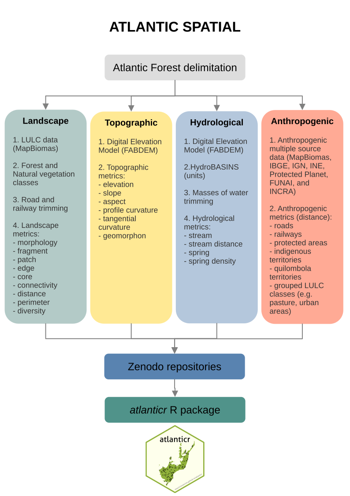
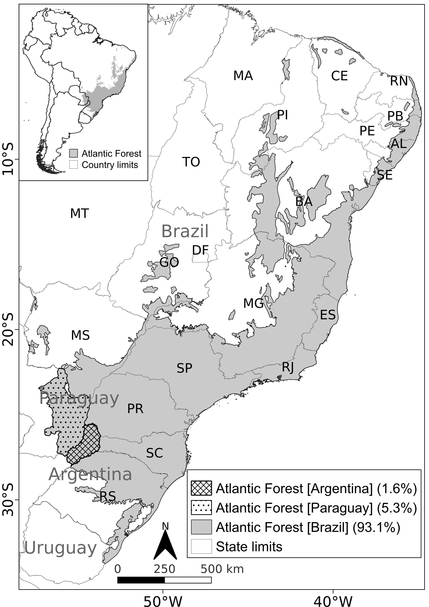
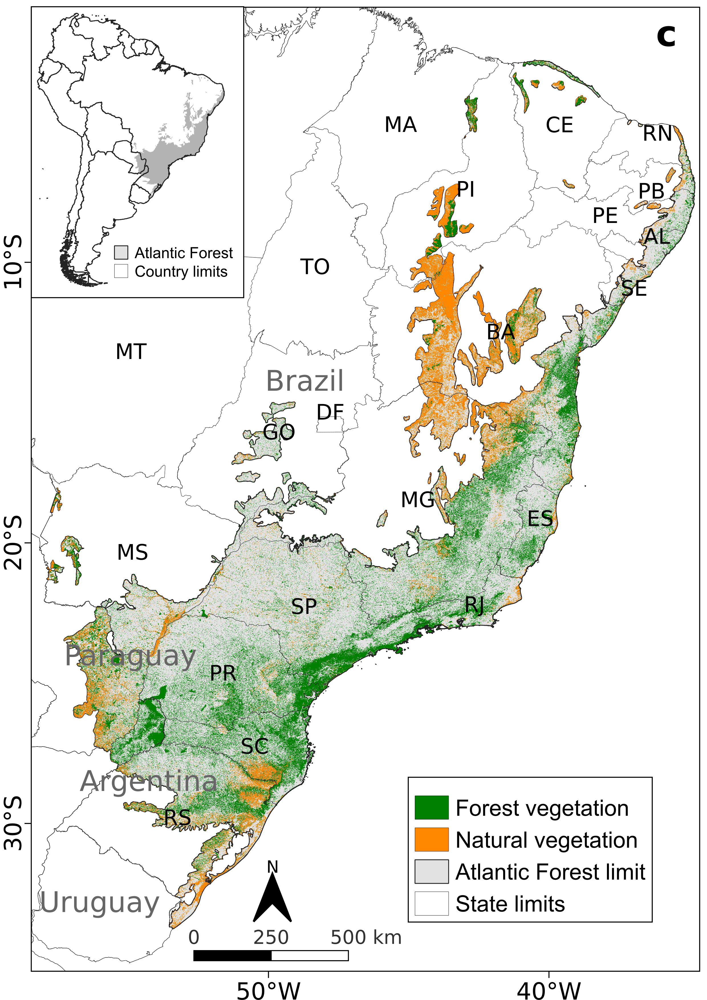
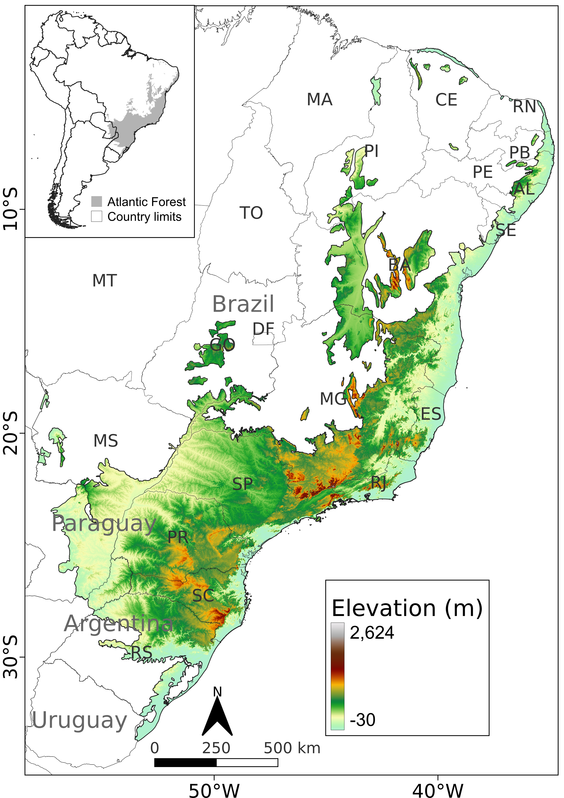

## Artigo

> Vancine, M. H., Niebuhr, B. B., Muylaert, R. L., Oshima, J. E. F., Tonetti, V., Bernardo, R., Alves, R. S. C., Zanette, E. M., Souza, V. C., Giovanelli, J. G. R., Grohmann, C. H., Galetti, M., & Ribeiro, M. C. (2026). ATLANTIC SPATIAL: a data set of landscape, topographic, hydrological and anthropogenic metrics for the Atlantic Forest. Ecology, 107(4), e70360.

## Contextualização

A Mata Atlântica é um dos principais hotspots da biodiversidade global, possuindo inúmeras espécies, sendo que grande parte delas só ocorre no bioma, isto é, são endêmicas. Apesar disso, a Mata Atlântica perdeu grande parte de sua cobertura florestal devido ao desmatamento ao longo de muitos anos de ocupação humana. Estimativas mais recentes indicam haver cerca de 23% de vegetação florestal e 36% de vegetação natural (somando todas suas fitofisionomias, como florestas e formações vegetacionais abertas, como savanas e campos abertos) para o ano base de 20201. Somada à drástica redução na cobertura de vegetação nativa, cerca de 8,2 milhões de hectares de floresta (5,2% dos 23%) e 7,9 milhões de hectares de vegetação nativa (3,1% dos 36%) estão contidos em fragmentos menores que 50 hectares, uma área equivalente ao tamanho de 50 campos de futebol1. Embora pareçam grandes, florestas desse tamanho não são suficientes para abrigar a enorme quantidade de espécies sensíveis à perda de habitat, além de sofrerem alterações nos processos ecológicos, como polinização e dispersão de sementes, por exemplo. Esses fragmentos considerados pequenos correspondem a cerca de 97% do total de fragmentos de floresta e outros tipos de vegetação nativa1.

Apesar disso, a Mata Atlântica ainda possui cerca de 18.000 espécies de plantas2, 2.600 tetrápodes (anfíbios, répteis, aves e mamíferos)3, 1.000 peixes4, 1.400 insetos sociais5, 2.000 borboletas6, 112.000 aracnídeos conhecidos7, e milhões de bactérias ainda desconhecidas8. Toda essa biodiversidade é relativamente bem estudada, uma vez que a região concentra grande parte das universidades e instituições de pesquisa brasileiras, tornando-a um dos biomas mais estudados do mundo. Apesar de não ter o apelo internacional de conservação que possui a Amazônia, cerca de 70% da população brasileira habita os domínios da Mata Atlântica. Esse fato, de um ponto de vista utilitário, já justifica a grande concentração dos estudos e as medidas de conservação e restauração, visando o bem-estar da população via serviços ecossistêmicos, como regulação do clima e provisão de água. 

Entretanto, apesar da grande quantidade de estudos, muitos deles reunidos em Data Papers (artigos de compilação de dados) publicados na revista científica **Ecology**9, ainda existia uma lacuna de conhecimento sobre as características ambientais da Mata Atlântica, como a paisagem (distribuição das florestas) e a topografia (relevo), por exemplo. Sob coordenação de pesquisadores da Unesp de Rio Claro, cientistas de diversas instituições compilaram e sistematizaram informações ambientais espacializadas para toda Mata Atlântica. O novo estudo intitulado **ATLANTIC SPATIAL: a dataset of landscape, topographic, hydrological and anthropic metrics for the Atlantic Forest** foi publicado na revista internacional *Ecology* e integra uma série de artigos que reúne informações sobre a biodiversidade da Mata Atlântica.

{width=45%}
{width=45%}

O estudo é liderado pelos pesquisadores Maurício Vancine (Unicamp) e Bernardo Niebuhr (NINA Noruega), além de diversos outros colaboradores, e disponibiliza mais de 500 camadas espaciais de métricas de paisagem, topografia, hidrografia e fatores antrópicos para a Mata Atlântica. O conjunto de dados possui mais de 230 GB de camadas raster, que são imagens com pequenos quadrados de mesmo tamanho (pixels), como uma imagem de uma foto tirada pelo celular, em que cada um desses quadrados possui valores espacializados das métricas. Esse conjunto de dados pode ser utilizado em novos estudos sobre a conservação da biodiversidade — como modelos de distribuição de espécies e planejamento sistemático da conservação — e restauração florestal, auxiliando pesquisadores e a sociedade em geral na preservação do bioma. 

O trabalho utilizou uma delimitação ampla da Mata Atlântica, a qual também inclui áreas do Brasil, Argentina e Paraguai, além de porções vegetacionais da Mata Atlântica que se espalham para o interior do Brasil, em regiões sobrepostas com Cerrado, Caatinga, Pampa e Pantanal. O estudo usou dados refinados (resolução espacial de 30 metros) do [MapBiomas](https://brasil.mapbiomas.org) para o ano de 2020. Foram considerados dois tipos de vegetação: florestal (floresta, mangue e restinga) e natural (incluindo florestas, savanas, gramíneas e outras vegetações não florestais). Além disso, os fragmentos de vegetação já são impactados por infraestruturas lineares, como rodovias pavimentadas e ferrovias, conforme um estudo anterior dos mesmos autores, que demonstrou um grande impacto sobre o tamanho dos fragmentos de vegetação remanescente1. 

São vários tipos de métricas, que tangem desde as classes de cobertura da terra (e.g. vegetação, pastagem, agricultura) até a distância de áreas protegidas, rodovias, relevo e características da paisagem. Por exemplo, são disponibilizadas 31 classes de cobertura da terra, além da distância entre essas classes agrupadas, que incluem vegetação florestal, vegetação natural, pastagem, cultura temporária, cultura perene, plantação florestal de eucalipto, áreas urbanas, mineração e água. As métricas da paisagem incluem uma classificação (borda de fragmentos e corredores ecológicos), área e perímetro dos fragmentos, conectividade e heterogeneidade da paisagem. As métricas topográficas incluem elevação, declividade, aspecto, curvaturas e elementos morfométricos do relevo (pico, cume, declive, cavidade, sopé, vale e plano). As métricas hidrológicas compreendem nascentes potenciais e sua concentração, além de riachos potenciais e distâncias deles. Por fim, o estudo ainda disponibiliza camadas de infraestruturas antrópicas, como rodovias pavimentadas, ferrovias, áreas protegidas, terras indígenas e quilombolas, e a respectiva distância a cada um deles.

::: {style="text-align: center;"}
{width=45%}
{width=45%}
:::

## Implicações para a conservação e restauração da Mata Atlântica

Disponibilizadas gratuitamente e de acesso imediato para qualquer pessoa interessada (links abaixo), essas camadas podem auxiliar estudos voltados para a conservação da biodiversidade. Por exemplo, as métricas podem ser utilizadas como preditoras das respostas das espécies à estrutura da paisagem, como a perda e fragmentação de habitat ou fatores antrópicos, como efeito de rodovias ou áreas urbanas. Além disso, esses dados podem também auxiliar a escolha de áreas prioritárias para conservação e/ou restauração, uma vez que essas análises consideram métricas de conectividade e diversidade da paisagem, que podem funcionar como indicadores ecológicos. Por fim, essas camadas não se limitam ao ambiente acadêmico das universidades. Elas podem auxiliar a tomada de decisão na sociedade em geral, como órgãos de fiscalização e controle ambiental, organizações não governamentais (ONGs) e até mesmo os setores privados que dependam dos serviços ecossistêmicos em seus modelos de negócios.

O artigo pode ser acessado aqui. Já o banco de dados com todas as camadas pode ser acessado em diversos links (tabela abaixo). Além disso, os autores criaram um pacote na linguagem R, ainda em desenvolvimento, que facilita o acesso aos dados do ATLANTIC SERIES, o pacote [atlanticr](https://mauriciovancine.github.io/atlanticr).

> **Tabela com os links das camadas**. Repositório Zenodo, títulos, links e DOIs do conjunto de dados ATLANTIC SPATIAL. Nós o separamos em vários repositórios Zenodo devido às limitações de tamanho e número de arquivos.

| Variáveis | Título do repositório | Link do repositório |
|-----------|-----------------------|---------------------|
| 000-004; 041-064 | ATLANTIC SPATIAL - Habitat                            | [https://zenodo.org/records/17180586](https://zenodo.org/records/17180586) |
| 005-040; 375-388 | ATLANTIC SPATIAL - Fragment                           | [https://zenodo.org/records/14574196](https://zenodo.org/records/14574196) |
| 065-112          | ATLANTIC SPATIAL - Core 30\|60\|90m Forest            | [https://zenodo.org/records/14529477](https://zenodo.org/records/14529477) |
| 113-144          | ATLANTIC SPATIAL - Core 120\|240m Forest              | [https://zenodo.org/records/14574249](https://zenodo.org/records/14574249) |
| 145-189              | ATLANTIC SPATIAL - Edge 30\|60\|90m Forest        | [https://zenodo.org/records/14529566](https://zenodo.org/records/14529566) |
| 190-219          | ATLANTIC SPATIAL - Edge 120\|240m Forest              | [https://zenodo.org/records/14577603](https://zenodo.org/records/14577603) |
| 220-267          | ATLANTIC SPATIAL - Core 30\|60\|90m Natural           | [https://zenodo.org/records/14577592](https://zenodo.org/records/14577592) |
| 268-299          | ATLANTIC SPATIAL - Core 120\|240m Natural             | [https://zenodo.org/records/14577598](https://zenodo.org/records/14577598) |
| 300-344              | ATLANTIC SPATIAL - Edge 30\|60\|90m Natural       | [https://zenodo.org/records/14529647](https://zenodo.org/records/14529647) |
| 345-374          | ATLANTIC SPATIAL - Edge 120\|240m Natural             | [https://zenodo.org/records/14577617](https://zenodo.org/records/14577617) |
| 389-436          | ATLANTIC SPATIAL - Connectivity                       | [https://zenodo.org/records/14529380](https://zenodo.org/records/14529380) |
| 437-446          | ATLANTIC SPATIAL - Diversity Shannon                  | [https://zenodo.org/records/14529710](https://zenodo.org/records/14529710) |
| 447-456          | ATLANTIC SPATIAL - Diversity Simpson                  | [https://zenodo.org/records/14529750](https://zenodo.org/records/14529750) |
| 457-462          | ATLANTIC SPATIAL - Topographic                        | [https://zenodo.org/records/14529237](https://zenodo.org/records/14529237) |
| 463-476          | ATLANTIC SPATIAL - Hydrological                       | [https://zenodo.org/records/14500641](https://zenodo.org/records/14500641) |
| 477-502          | ATLANTIC SPATIAL - Anthropogenic                      | [https://zenodo.org/records/14529355](https://zenodo.org/records/14529355) |

## Citações

1. Vancine, M. H., Muylaert, R. L., Niebuhr, B. B., Oshima, J. E. F., Tonetti, V., Bernardo, R., De Angelo, C., Rosa, M. R., Grohmann C. H., & Ribeiro, M. C. (2024). The Atlantic Forest of South America: spatiotemporal dynamics of vegetation and implications for conservation. Biological Conservation, 291, 110499.
2. Flora e Funga do Brasil. Jardim Botânico do Rio de Janeiro. (2023). [link](http://floradobrasil.jbrj.gov.br/).
3. Figueiredo, M. de S. L. et al. Tetrapod Diversity in the Atlantic Forest: Maps and Gaps. in The Atlantic Forest (eds. Marques, M. C. M. & Grelle, C. E. V.) 185–204 (Springer International Publishing, 2021).
4. Reis, R. E. et al. Fish biodiversity and conservation in South America. Journal of Fish Biology 89, 12–47 (2016).
5. Feitosa, R. M. et al. Social Insects of the Atlantic Forest. in The Atlantic Forest: History, Biodiversity, Threats and Opportunities of the Mega-diverse Forest (eds. Marques, M. C. M. & Grelle, C. E. V.) 151–183 (Springer International Publishing, 2021). doi:10.1007/978-3-030-55322-7_8.
6. Iserhard, C., Uehara-Prado, M., Marini-Filho, O., Duarte, M. & Freitas, A. Fauna da Mata Atlântica: Lepidoptera-Borboletas. in Revisões em zoologia: Mata Atlântica (eds. Monteiro-Filho, E. L. de A. & Conte, C. E.) 57–102 (Editora UFPR, 2017).
7. Giupponi, A. et al. Aracnídeos da Mata Atlântica. in Revisões em zoologia: Mata Atlântica (eds. Filho, E. L. A. M. & Conte, C. E.) 129–235 (Editora UFPR, 2017).
8. Lambais, M. R., Crowley, D. E., Cury, J. C., Büll, R. C. & Rodrigues, R. R. Bacterial Diversity in Tree Canopies of the Atlantic Forest. Science 312, 1917–1917 (2006).
9. ATLANTIC: Data Papers from a biodiversity hotspot: Ecology. [link](https://esajournals.onlinelibrary.wiley.com/doi/toc/10.1002/(ISSN)1939-9170.AtlanticPapers).

---

<button id="topBtn" onclick="window.scrollTo({top: 0, behavior: 'smooth'});">↑ Topo</button>

