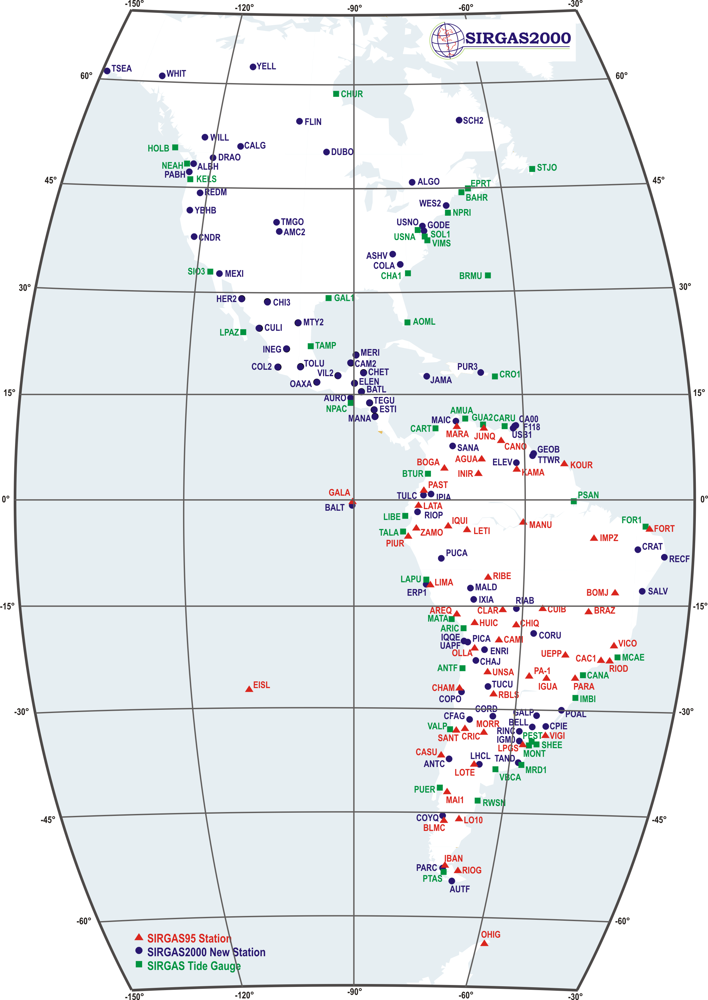

<link href="../../site_libs/vembedr-0.1.5/css/vembedr.css" rel="stylesheet" />

## Contextualização

Um dos primeiros assuntos que devemos entender antes de iniciar no mundo do **Geoprocessamento** são os conceitos de **Sistema de Referência de Coordenadas** e **Datum**. Esses conceitos atrelados à Cartografia apesar de **parecerem simples** para quem possui certa experiência na área de Geoprocessamento, muitas vezes são **confundidos ou mesmo ignorados** por aqueles que estão adentrando nessa área.

Dessa forma, minha intenção com esse post é **transmitir esses conceitos de forma simples e objetiva**, usando uma linguagem prática, para facilitar seu uso no dia a dia. Não adentro aqui em como aplicar esses conceitos em softwares de SIG ou toda a matemática envolvida. Para se aprofundar, recomendo livros específicos no final do post ou mesmo procurar disciplinas de Engenharia Cartográfica e/ou Geodéria.

## Sistema de Referência de Coordenadas

Os dados geoespaciais (vetor e raster, explicados com detalhes neste [post](https://mauriciovancine.github.io/pt/post/geo-geospatial-data)), possuem um componente fundamental, que é o **Sistema de Referência de Coordenadas** ou do inglês *Coordinate Reference System (CRS)*, que define esses dados representam uma feição na superfície da Terra.

O Sistema de Referência de Coordenadas é composto de **quatro componentes**:

1.  **Sistema de coordenadas**: grade X e Y na qual os dados são sobrepostos e localizados no espaço
2.  **Unidades horizontais e verticais**: unidades usadas para definir a grade ao longo dos eixos X e Y
3.  **Datum**: versão modelada da forma da Terra que define a origem usada para localizar o sistema de coordenadas no planeta
4.  **Informações de projeção**: equação matemática usada para nivelar objetos que estão em uma superfície redonda para visualização em uma superfície plana

O **Sistema de coordenadas** é classificado com base nas **Unidades horizontais e verticais** que estão sendo utilizadas para a representação geográfica, podendo assumir dois tipos: **ângulos** para **Sistema de Coordenadas Geográficas** e **metros** para **Sistema de Coordenadas Projetadas**.

Outro componente é o **datum**, que é a **relação** desses sistemas de coordenadas com a superfície da Terra. O datum faz parte de uma área da **Cartografia** denominada **Geodésia** que estuda a forma e dimensões da Terra, campo gravitacional e a localização de pontos fixos e sistemas de coordenadas.

Por fim, as **Informações de projeção** que são equações matemáticas constituídas com base nas informações anteriores permite a representação e cálculos de propriedades das feições representadas nos mapas. Esse tópico não abordaremos aqui por estarem fora da minha alçada... Muito senos, cossenos, dericadas e integrais... Melhor deixar para os geofísicos e engenheiros cartográficos...

Veremos mais informações para o uso prático, focado no **Sistemas de Coordenadas** e **Datum** e como combiná-los para formar o Sistema de Referência de Coordenadas.

## Sistema de Coordenadas Geográficas

O **Sistema de Coordenadas Geográficas** utiliza **ângulos** para representar feições na superfície da Terra através de dois valores: longitude e latitude. A **longitude** localiza-se na direção Leste-Oeste e a **latitude** localiza-se na direção Norte-Sul. Nesse sistema, a **superfície da Terra** geralmente é representada por uma **superfície elipsoidal**, pois a Terra é ligeiramente achatada nos pólos (Figura @ref(fig:fig-geo)).

## Sistema de Coordenadas Projetadas

O **Sistema de Coordenadas Projetadas** utiliza um **Sistema Cartesiano de Coordenadas** em uma **superfície plana**. Dessa forma, à partir de uma origem, traçam-se eixos X e Y, e uma unidade linear, como o **metro**, é utilizada para representar as feições.

Todos as **projeções** são feitas a partir de sistemas geográficos, convertendo uma **superfície tridimensional** em uma **superfície plana bidimensional**. Sendo assim, essa conversão trás consigo algum tipo de **distorção em relação à porção real**, podendo ser distorções em: 1. formas locais, 2. áreas, 3. distâncias, 4. flexão ou curvatura, 5. assimetria e 6. lacunas de continuidade. Dessa forma, um sistema de coordenadas projetadas pode preservar somente uma ou duas dessas propriedades.

Dois vídeos ajudam a entender melhor essas distorções:

**Todos os mapas do mundo são imperfeitos. Entenda as razões e as soluções para amenizar distorções**

<iframe src="https://www.youtube.com/embed/zUE5LOwFrvk" width="533" height="300" frameborder="0" allowfullscreen="" data-external="1"></iframe>

**Why all world maps are wrong**

<iframe src="https://www.youtube.com/embed/kIID5FDi2JQ" width="533" height="300" frameborder="0" allowfullscreen="" data-external="1"></iframe>

Existem **três grandes grupos** de projeções: planares, cônicos e cilíndricos (Figura @ref(fig:fig-proj)).

Na **projeção plana**, também denominada **Projeção Azimutal**, o mapeamento toca o globo em um ponto ou ao longo de uma linha de tangência, sendo normalmente usado no mapeamento de regiões polares, sendo a mais comum a **Projeção Azimutal Equidistante**, a mesma utilizada na bandeira da ONU (Figura @ref(fig:fig-plana)).

Na **projeção cônica**, a superfície da Terra é projetada em um **cone** ao longo de uma linha ou duas linhas de tangência, de modo que as distorções são minimizadas ao longo das linhas e aumentam com a distância das mesmas, sendo portanto, mais adequada para mapear áreas de latitudes médias, tendo como exemplo mais conhecidos a **Projeção Cônica Equivalente de Albers** e a **Projeção Cônica Conforme de Lambert** (Figura @ref(fig:fig-conica)).

Na **projeção cilíndrica**, a superfície da Terra é mapeada em um **cilindro**, sendo também criada tocando a superfície da Terra ao longo de uma ou duas linhas de tangência, sendo utilizada com mais frequência para mapear todo o globo, tendo como exemplo mais conhecido a **Projeção Universal Transversa de Mercator (UTM)**, **Projeção de Winkel Tripel** e **Projeção de Mollweide**(Figura @ref(fig:fig-cilindrica)).

## Datum

Como dito anteriormente, o **datum** é a **relação** do sistema de coordenadas com a superfície da Terra. Ele representa o **ponto de intersecção** do elipsoide de referência com a superfície da Terra (geoide, a forma verdadeira da Terra), compensando as diferenças do campo gravitacional da Terra (Figura @ref(fig:fig-datum)).

Existem dois tipos de datum: geocêntrico e local (Figura @ref(fig:fig-datum-geo-local)). Para um **datum geocêntrico**, como o **WGS84 - World Geodetic System 1984**, o centro do elipsoide é o centro de gravidade da Terra e a precisão das projeções não é otimizada para um local específico do globo. Já em um **datum local**, como o **SAD69 - South American Datum 1969**, o elipsoide de referência é deslocado para se alinhar com a superfície em um determinado local, como por exemplo, na América do Sul para o SAD69 (Figura @ref(fig:fig-datum-geo-local)).

No Brasil, desde 2015, o [Instituto Brasileiro de Geografia e Estatística (IBGE)](https://www.ibge.gov.br/) adotou utilizar o datum **SIRGAS2000 - Sistema de Referencia Geocéntrico para las Américas 2000** para todos os mapeamentos realizados no Brasil, um esforço conjunto para adotar o mesmo datum em toda a América. Mais sobre esse datum pode ser lido aqui: [SIRGAS2000](http://www.sirgas.org/pt/sirgas-realizations/sirgas2000/) (Figura @ref(fig:fig-sirgas))

Comparando os **datum SAD69 e SIRGAS2000**, podemos notar uma **diferença de cerca de 65 metros**, que à depender do mapeamento pode fazer uma **grande diferença**, a exemplo da planta de uma casa ou a construção de uma ponte (Figura @ref(fig:fig-datum-comp))

## Uso na prática dos Sistemas de Referência de Coordenadas

Na prática, o **uso dos Sistemas de Referência de Coordenadas** é **relativamente simples**. Primeramente, devemos entender a diferença entre os Sistemas de Coordenadas Geográficas, Sistemas de Coordenadas Projetadas e Datum.

Uma vez entendido isso, podemos passar para o passo seguinte: definir qual o **melhor datum** para nossa região de interesse. E nesse passo, o IBGE já nos ajudou, devemos adotar sempre que possível o Datum SIRGAS2000, salvo raras exceções mais específicas que não adentraremos aqui. Além disso, há uma aproximação com o datum WGS84, facilitando a conversão de datum.

Por fim, devemos **escolher se usaremos Coordenadas Geográfica ou Projetadas**. Isso vai depender muito dos **objetivos do nosso mapeamento**. Se não faremos cálculos de áreas, ângulos ou distâncias, e estamos interessados em **representar nossos dados** da melhor forma possível, não há motivos para não escolher Coordenadas Geográficas. Logo, nosso Sistemas de Referência de Coordenadas ficaria dessa forma: **Coordenadas Geográficas com Datum SIRGAS2000 ou WGS84**. Essas coordendas geográficas podem ainda ser representadas em graus, minutos e segundos, ou em graus decimais.

-   23°23'23"S 42°42'42"O; WGS 84
-   23°23'23"S 42°42'42"O; SIRGAS 2000
-   -23.38972, -42.71167; WGS 84

Agora, se o **objetivo do mapeamento** é o **cálculo de áreas, distâncias ou formas**, devemos usar **Coordenadas Projetadas**, pois as unidades são em metros. Mas aqui começa a complicação. Pela minha experiência prática, a primeira coisa a se considerar é a escala: se for uma escala local, podemos começar pelo uso do UTM, principalmente se todos os dados caem na mesma zona. Logo, nosso Sistemas de Referência de Coordenadas ficaria dessa forma: **Coordenadas Projetadas UTM (zona) com Datum SIRGAS2000 ou WGS84**, com coordenadas sempre representadas em metros.

-   23K 733876E, 7411482S; WGS 84
-   23K 733876E, 7411482S; SIRGAS 2000

Entretanto, se partimos para **escala regionais** (continente) ou **globais** (todo o mundo), devemos considerar projeções cônicas e/ou cilíndricas, repectivamente, além de observar as distorsões em área, distâncias ou formas, que ficam muito maiores a depender das que escolhemos. Basicamente existem três tipos de projeções: **1) conforme** (não deforma ângulo)s, **2) equivalente** (não altera áresas, e **3) equidistante** (não deforma distâncias), e principalmente, quando nos afastamos das **linhas linhas de tangência** dessas projeções.

## Códigos para os Sistemas de Referência de Coordenadas

Por fim, algo que ajuda a simplicar esses conceitos são o código numérico `epsg` e código em texto `proj4string`. O código EPSG (*European Petroleum Survey Group*) é uma sequência de numérica curta, referindo-se apenas a um CRS. O site [epsg.io](http://epsg.io/) permite consultar diversas informações sobre um código, como procurar por um número do código, representação de mapas e fazer transformações de CRSs (Figura @ref(fig:fig-epsg)).

Já o código em texto `proj4string` permite mais flexibilidade para especificar diferentes parâmetros, como o tipo de projeção, datum e elipsóide. Dessa forma, é possível especificar muitas projeções, ou mesmo modificar as projeções existentes, tornando a representação `proj4string` mais complexa e flexível.

Além disso, ainda é possível consultar uma extensa lista de CRSs no site [spatialreference.org](https://spatialreference.org/), que fornece descrições em diversis formatos, baseados em **GDAL** e **Proj.4**. Essa abordagem permite consultar uma URL que pode produzir uma referência espacial em um formato que um software SIG pode utilizar como referência.

Vale também se aprofundar no [PROJ](https://proj.org/index.html), que é um software de transformação de coordenadas. Há diversas projeções, com mais detalhamentos.

## Para se aprofundar

Aqui ofereço apenas os conceitos básicos e bem superficiais, de forma prática. Para se aprofundar no tema, sugiro a leitura dos livros listados abaixo.

-   Lapaine, M., & Usery, E. L. (Eds.). (2017). [Choosing a map projection](https://www.springer.com/gp/book/9783319518343). Springer International Publishing.

-   Oliveira, C. D. (1993). [Curso de cartografia moderna](https://biblioteca.ibge.gov.br/visualizacao/livros/liv81158.pdf). IBGE.

-   Nogueira, R. E. (2008). Cartografia: representação, comunicação e visualização de dados espaciais. Ed. UFSC.

-   Duarte, P. A. (2002). Fundamentos de cartografia. Ed. UFSC.

Fonte da imagem: [Sara Riaño/Unsplash](https://unsplash.com/pt-br/fotografias/foto-de-foco-seletivo-do-globo-de-mesa-qoKTJo2zpRs).
