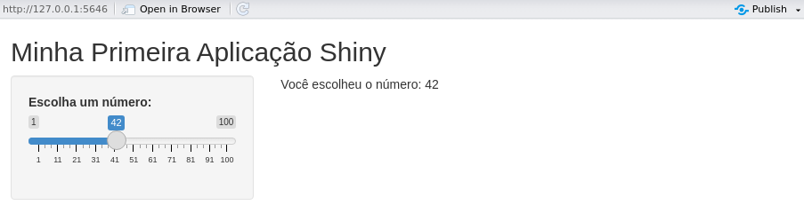

## Contextualização

Eu tive conhecimento do [shiny](https://shiny.posit.co/) lá por volta de 2017. Em 2018, trabalhei um pouco com a ferramenta para desenvolver uma aplicação que coletava pontos de classes de uso e cobertura da terra na Amazônia. Desde então, nunca mais trabalhei com a ferramente e ela teve uma séria de modificações e aprimoramentos que pretendo estudar.

Este post é o começo da retomada desses estudos.

## Desenvolvimento

### Pacote shiny

[Shiny](https://shiny.posit.co/) é um pacote do R que permite criar aplicações web interativas a partir do código R, sem a necessidade de conhecimentos avançados em desenvolvimento web.

Ele é amplamente utilizado por cientistas de dados, pesquisadores e analistas para criar [dashboards](https://en.wikipedia.org/wiki/Dashboard_(computing)), que são ferramentas de visualização e interfaces interativas para manipulação de dados e modelos estatísticos.

Com o **shiny** é possível integrar gráficos, tabelas e entradas de usuário em uma aplicação que pode ser executada localmente ou publicada na web, tornando os resultados das análises mais acessíveis para públicos não especializados.

### Estrutura geral de uma aplicação shiny

Uma aplicação Shiny é composta por três partes principais:

**1. Interface do usuário (*User Interface* - UI)**

A **UI** define o layout e os elementos visuais da aplicação. Ela é onde você organiza componentes como painéis, menus, sliders, gráficos e tabelas. Para criar uma interface, você utiliza funções como `fluidPage()`, `sidebarLayout()` e outros componentes interativos.

Exemplo de componentes comuns:

-   **`fluidPage()`**: Layout fluido que ajusta os elementos à largura da janela.
-   **`sidebarLayout()`**: Divide a aplicação em uma barra lateral e um painel principal.
-   **`sliderInput()`**: Adiciona um controle deslizante.
-   **`textOutput()`**: Exibe texto gerado dinamicamente.

``` r
ui <- fluidPage(
  titlePanel("Título da Aplicação"),
  sidebarLayout(
    sidebarPanel(
      sliderInput("slider", "Escolha um valor:", min = 1, max = 100, value = 50)
    ),
    mainPanel(
      textOutput("output_text")
    )
  )
)
```

**2. Servidor (*Server*)**

O **Servidor** processa entradas, realiza cálculos ou análises e fornece as saídas que serão exibidas na interface. Ele utiliza funções reativas como `renderText()`, `renderPlot()`, `renderTable()`, entre outras.

No exemplo abaixo, o valor escolhido no slider é exibido como texto:

``` r
server <- function(input, output) {
  output$output_text <- renderText({
    paste("Você selecionou o valor:", input$slider)
  })
}
```

**3. Função Principal**

A função `shinyApp()` conecta a interface e o servidor, e executa a aplicação:

``` r
shinyApp(ui = ui, server = server)
```

Aplicação **shiny** sendo executada localmente:



### Layouts e estilos no shiny

O Shiny oferece diferentes layouts para organizar os elementos da interface:

-   **`fluidPage()`**: layout fluido básico
-   **`navbarPage()`**: layout com abas de navegação
-   **`sidebarLayout()`**: layout com barra lateral
-   **`splitLayout()`**: divide a página em várias colunas

Exemplo de layout com abas:

``` r
ui <- navbarPage(
  "Minha Aplicação",
  tabPanel("Aba 1", textOutput("text1")),
  tabPanel("Aba 2", textOutput("text2"))
)
```

Você pode usar CSS para personalizar sua aplicação Shiny. O CSS pode ser incluído diretamente no código ou em arquivos externos.

``` r
ui <- fluidPage(
  tags$style(HTML("
body {background-color: #f4f4f9;}
h1 {color: #4CAF50;}
")),
  titlePanel("Aplicação com Estilo")
)
```

### Principais funcionalidades

As funcionalidades do Shiny oferecem uma ampla gama de possibilidades, permitindo desde a manipulação de dados até a criação de interfaces sofisticadas e visualizações dinâmicas. Abaixo, os principais recursos foram organizados e detalhados para destacar suas aplicações práticas:

-   **Interatividade**: permite criar elementos interativos como sliders, caixas de seleção, botões, menus suspensos e upload de arquivos
-   **Visualizações interativas**: integração com pacotes gráficos como ggplot2, plotly e leaflet para criar gráficos, mapas e tabelas interativos
-   **Reatividade**: permite que os outputs mudem automaticamente sempre que uma entrada for alterada, sem a necessidade de recarregar a página
-   **Gerenciamento de dados**: leitura, manipulação e visualização de grandes volumes de dados diretamente na interface, além de conexão com APIs para obter dados externos em tempo real
-   **Upload e download de arquivos**: permite que os usuários carreguem arquivos para a aplicação e baixem resultados
-   **Integração com banco de dados**: conexão com bancos SQL (MySQL, PostgreSQL) e NoSQL (MongoDB) para leitura e gravação de dados
-   **Sessões e logs**: gerenciamento de múltiplos usuários com sessões personalizadas e registre interações para auditoria e monitoramento
-   **Criação de dashboards**: construção de interfaces amigáveis e responsivas para análise de dados.
    Uso de pacotes como shinydashboard para design de painéis sofisticados
-   **Escalabilidade e hospedagem**: implantação local, em servidores Shiny Server, ou na nuvem (ex.: ShinyApps.io)

### Interatividade

A interatividade é um dos principais diferenciais do **Shiny**, permitindo a criação de interfaces altamente dinâmicas e adaptáveis. Essa funcionalidade possibilita que os usuários interajam diretamente com a aplicação para controlar inputs, visualizar resultados em tempo real e realizar ajustes personalizados. Abaixo, detalhamos os elementos principais:

**1. Elementos de entrada (*inputs*)**  
Os elementos de entrada são componentes que permitem ao usuário fornecer dados ou ajustar parâmetros da aplicação. Exemplos incluem:

-   **Sliders (`sliderInput()`)**:
    -   Controle de valores numéricos contínuos ou intervalos
    -   Usado para definir filtros, limites de dados ou parâmetros em análises
    -   Exemplo: Escolher uma faixa de tempo para análise
-   **Caixas de Seleção (`checkboxInput()`, `checkboxGroupInput()`)**:
    -   Permitem escolhas binárias (sim/não) ou múltiplas
    -   Exemplo: Ativar ou desativar camadas em um mapa interativo
-   **Botões (`actionButton()`)**:
    -   Executam ações específicas apenas quando clicados
    -   Exemplo: Iniciar uma análise estatística ou atualizar um gráfico
-   **Menus Suspensos (`selectInput()`, `pickerInput()`)**:
    -   Apresentam opções de forma compacta, permitindo que o usuário selecione uma ou mais
    -   Exemplo: Escolher uma variável em um conjunto de dados para análise
-   **Campos de Texto e Áreas de Texto (`textInput()`, `textareaInput()`)**:
    -   Permitem a entrada de texto pelo usuário
    -   Exemplo: Inserir nomes, códigos ou descrições para relatórios
-   **Upload de Arquivos (`fileInput()`)**:
    -   Usuários podem carregar arquivos diretamente para a aplicação
    -   Exemplo: Importar dados de planilhas ou imagens para visualização ou análise

**2. Elementos de saída (*outputs*)**  
Os elementos de saída exibem os resultados das interações realizadas pelo usuário. Exemplos incluem:

-   **Gráficos e Mapas Interativos**:
    -   Atualizam dinamicamente com base nos inputs fornecidos
    -   Integração com pacotes como `ggplot2`, `plotly` e `leaflet`
-   **Tabelas (`renderTable()`, `DT::renderDataTable()`)**:
    -   Apresentam dados em formatos tabulares, com suporte para filtros e ordenações
-   **Textos Dinâmicos (`renderText()`)**:
    -   Exibem resultados de cálculos ou mensagens personalizadas com base nos inputs

**3. Reatividade e feedback imediato**  
A interatividade no Shiny é alimentada pela **reatividade**, que permite que outputs sejam atualizados automaticamente sempre que um input associado for alterado.

-   **Reatividade Automática**:
    -   Funções reativas como `reactive()`, `observe()`, e `observeEvent()` monitoram mudanças nos inputs e disparam atualizações dos outputs
    -   Exemplo: Um gráfico que muda dinamicamente ao ajustar um slider de faixa etária
-   **Feedback Visível**:
    -   Indicadores de carregamento (`withProgress()`) são usados para mostrar que uma operação está em andamento
    -   Exemplo: Barra de progresso ao carregar um grande conjunto de dados

**4. Integração de inputs e outputs**  
Os inputs e outputs podem ser combinados para criar fluxos de trabalho interativos complexos. Exemplo:
1. O usuário carrega um arquivo CSV
2. Seleciona colunas específicas para visualização usando menus suspensos
3. Ajusta parâmetros com sliders e filtros
4. Visualiza os resultados em gráficos e tabelas dinâmicos

**5. Exemplos práticos**
- **Painéis de controle**: dashboards interativos que permitem explorar dados ajustando sliders, menus e caixas de seleção
- **Filtros dinâmicos**: refinamento de gráficos e tabelas em tempo real com base nos parâmetros selecionados
- **Aplicações educacionais**: simulações de modelos matemáticos ou ecológicos em que o usuário ajusta variáveis para observar resultados

### Reatividade

A **reatividade** é um dos conceitos mais importantes do Shiny. Ela permite que elementos da aplicação sejam atualizados automaticamente quando os valores de entrada mudam.

Isso pode ser feito com dados de entrada e saída:
- **Inputs**: elementos de entrada fornecidos pelo usuário, como sliders, caixas de seleção, botões, etc.
- **Outputs**: elementos de saída que exibem resultados, como texto, tabelas, gráficos ou mapas

As expressões reativas monitoram as entradas e são reexecutadas automaticamente quando uma entrada associada é alterada. Funções reativas incluem:

-   **`renderText()`**: gera texto
-   **`renderPlot()`**: gera gráficos
-   **`renderTable()`**: gera tabelas

Exemplo de reatividade:

``` r
server <- function(input, output) {
  output$squared <- renderText({
    paste("O quadrado do valor é:", input$slider^2)
  })
}
```

### Visualizações interativas

O **Shiny** é amplamente utilizado para criar visualizações interativas, permitindo aos usuários explorar e analisar dados de forma dinâmica. A seguir, apresento detalhes sobre como criar e personalizar visualizações interativas no **Shiny**, abordando pacotes, exemplos práticos e boas práticas.

No Shiny, as visualizações podem incluir gráficos, mapas, tabelas e outras representações interativas. Aqui estão alguns exemplos:

-   **Gráficos 2D/3D**: criados com pacotes como **ggplot2**, **plotly**, e **echarts4r**
-   **Mapas interativos**: desenvolvidos com **leaflet** ou **mapdeck**
-   **Tabelas interativas**: usando **DT** (DataTables) para permitir ordenação, pesquisa e exportação
-   **Gráficos dinâmicos**: gráficos de dispersão interativos ou heatmaps

**Gráficos**
- **ggplot2**: criação de gráficos estáticos que podem ser integrados ao Shiny
- **plotly**: transforma gráficos `ggplot2` em interativos ou cria gráficos do zero

``` r
output$plot <- renderPlotly({
  plot_ly(data = mtcars, x = ~mpg, y = ~hp, type = 'scatter', mode = 'markers')
})
```

-   **highcharter**: gráficos interativos baseados na biblioteca JavaScript Highcharts
-   **echarts4r**: biblioteca moderna para gráficos altamente personalizáveis

**Mapas**
- **leaflet**: Criação de mapas interativos com marcadores, pop-ups e camadas

``` r
output$map <- renderLeaflet({
  leaflet() %>%
    addTiles() %>%
    addMarkers(lng = -47.92, lat = -15.78, popup = "Brasília")
})
```

-   **tmap**: alternativa para mapas interativos temáticos
-   **sf** + **shiny**: manipulação de dados espaciais e visualização

**Tabelas**
- **DT**: permite criar tabelas interativas com filtros, ordenação e exportação de dados

``` r
output$table <- renderDT({
  datatable(mtcars, options = list(pageLength = 5))
})
```

**Dashboards**
- **shinydashboard**: usado para criar dashboards com painéis interativos
- **flexdashboard**: integração de gráficos e tabelas em painéis

### Publicação de aplicações

Publicações podem ser feitas localmente ou na web.

Publicações locais geralmente são sadas para testes através da função `runApp()` executa a aplicação localmente.

``` r
shiny::runApp()
```

Publicações na web são realizadas através do [**ShinyApps.io**](https://www.shinyapps.io/) ou em servidores próprios usando o RStudio Connect.

Essa plataforma da RStudio permite hospedar aplicações Shiny. Basta criar uma conta, instalar o pacote `rsconnect` e seguir os passos para publicar sua aplicação.

``` r
library(rsconnect)
rsconnect::deployApp("caminho/para/sua/aplicacao")
```

Você pode usar o **Shiny Server** (versão gratuita ou Pro) para hospedar suas aplicações em um servidor Linux.

## Conclusão

O **shiny** é uma ferramenta extremamente flexível e poderosa, sendo amplamente utilizado em visualização de dados, criação de dashboards e aplicações analíticas.

## Para saber mais

### Sites

-   [Programando em Shiny](https://programando-em-shiny.curso-r.com/)

### Livros

-   Beeley, C. (2016). Web Application Development With R Using Shiny: Integrate the Power of R With the Simplicity of Shiny to Deliver Cutting-edge Analytics over the Web (2nd edition). Packt Pub Ltd.
-   Beeley, C., & Sukhdeve, S. R. (2018). Web application development with R using Shiny: Build stunning graphics and interactive data visualizations to deliver cutting-edge analytics (Third edition). Packt Publishing.
-   Fay, C., Rochette, S., Guyader, V., & Girard, C. (2021). Engineering Production-Grade Shiny Apps (1st edition). Chapman and Hall/CRC. https://engineering-shiny.org/
-   Granjon, D. (2022). Outstanding user interfaces with Shiny (First edition). CRC Press. https://doi.org/10.1201/9781003124924
-   Majumdar, P. (2021). Learn Emotion Analysis with R. BPB Publications.
-   Moon, K.-W. (2016). Learn ggplot2 Using Shiny App (1st ed. 2016). Springer International Publishing: Imprint: Springer. https://doi.org/10.1007/978-3-319-53019-2
-   Moraga, P. (2020). Geospatial health data: Modeling and visualization with R-INLA and Shiny. CRC Press.
-   Sievert, C. (2020). Interactive web-based data visualization with R, plotly, and shiny. CRC Press, Taylor and Francis Group.
-   Wickham, H. (2021). Mastering Shiny: Build Interactive Apps, Reports, and Dashboards Powered by R (1ª edição). O'Reilly Media. https://mastering-shiny.org/
-   Wiley, M. (with Wiley, J. F.). (2020). Advanced R 4 Data Programming and the Cloud: Using PostgreSQL, AWS, and Shiny (2nd ed). Apress L. P.

### Vídeos

-   [Dashboard com R Shiny - Gabriel Lima Gomes](https://www.youtube.com/watch?v=l-Xfp1IYUF0&list=PL-TW4kUtfFVykid5T5IYKOMqhti7HBDc9)
-   [10 dicas para programar melhor em Shiny - Curso-R](https://www.youtube.com/watch?v=u9YqkQQ_1C0)
-   [R Shiny Web Application - Data Professor](https://www.youtube.com/playlist?list=PLtqF5YXg7GLkxx_GGXDI_EiAvkhY9olbe)

### Cursos pagos

-   [Dashboards em Shiny - Curso R](https://curso-r.com/cursos/dashboards/)
-   [Deploy - Curso R](https://curso-r.com/cursos/deploy/)
-   [Aplicações e dashboards com R - Ômega Data Science](https://escola.omegadatascience.com.br/dashboards/26/aplicacoes-e-dashboards-com-r-essentials/)

Fonte da imagem: [Posit](https://shiny.posit.co/).
