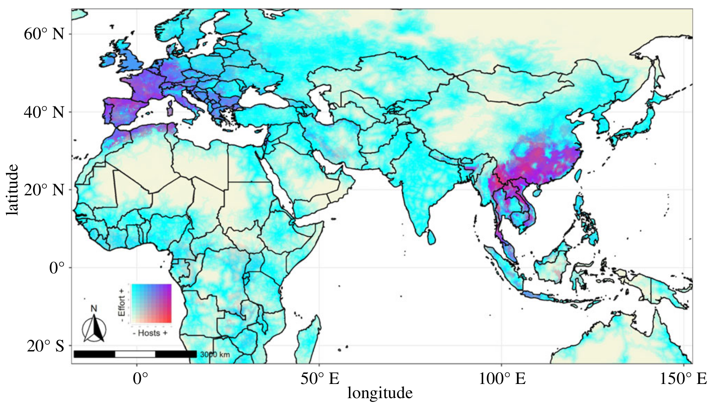

<div class="mt-4 d-flex flex-row flex-wrap gap-1 justify-content-left justify-content-sm-start" role="group" aria-label="Links">
  <a href="https://doi.org/10.1098/rspb.2022.0397" class="btn btn-custom text-capitalize" target="_blank"><i class="ai ai-doi me-1"></i>DOI</a>
  <a href="/publications/2022-muylaert-etal.pdf" class="btn btn-custom text-capitalize" target="_blank"><i class="bi bi-file-earmark-pdf me-1"></i>PDF</a>
</div>

<style>
  .btn-custom {
    background-color: white;
    border: 1px solid #1c6cbe; /* Borda azul */
    color: #1c6cbe; /* Texto azul */
    transition: background-color 0.3s, color 0.3s;
  }
  .btn-custom:hover {
    background-color: #1c6cbe; /* Cor de fundo azul ao passar o mouse */
    color: white; /* Texto branco */
  }
</style>

<br> 



## Resumo

Global changes in response to human encroachment into natural habitats and carbon emissions are driving the biodiversity extinction crisis and increasing disease emergence risk. Host distributions are one critical component to identify areas at risk of spillover, and bats act as reservoirs of diverse viruses. We developed a reproducible ecological niche modelling pipeline for bat hosts of SARS-like viruses (subgenus Sarbecovirus), given that since SARS-CoV-2 emergence several closely-related viruses have been discovered and sarbecovirus-host interactions have gained attention. We assess sampling biases and model bats’ current distributions based on climate and landscape relationships and project future scenarios. The most important predictors of species distribution were temperature seasonality and cave availability. We identified concentrated host hotspots in Myanmar and projected range contractions for most species by 2100. Our projections indicate hotspots will shift east in Southeast Asia in >2 °C hotter locations in a fossil-fueled development future. Hotspot shifts have implications for conservation and public health, as loss of population connectivity can lead to local extinctions, and remaining hotspots may concentrate near human populations.

## Citação

```

@article{muylaert_etal_2021,
  title = {Present and future distribution of bat hosts of sarbecoviruses: implications for conservation and public health},
  url = {https://www.biorxiv.org/content/10.1101/2021.12.09.471691v1},
  doi = {10.1098/rspb.2022.0397},
  language = {en},
  publisher = {bioRxiv},
  author = {Muylaert, Renata L. and Kingston, Tigga and Luo, Jinhong and Vancine, Maurício Humberto and Galli, Nikolas and Carlson, Colin J. and John, Reju Sam and Rulli, Maria Cristina and Hayman, David T. S.},
  month = dec,
  year = {2021},
}
```
