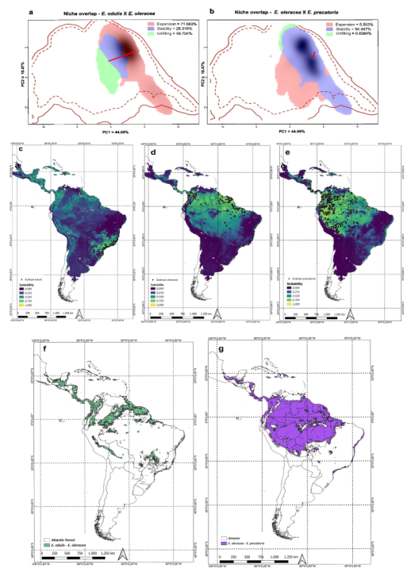

<div class="mt-4 d-flex flex-row flex-wrap gap-1 justify-content-left justify-content-sm-start" role="group" aria-label="Links">
  <a href="https://doi.org/10.1186/s12870-025-07775-1" class="btn btn-custom text-capitalize" target="_blank"><i class="ai ai-doi me-1"></i>DOI</a>
  <a href="/publications/2025-francisconi-etal.pdf" class="btn btn-custom text-capitalize" target="_blank"><i class="bi bi-file-earmark-pdf me-1"></i>PDF</a>
</div>

<style>
  .btn-custom {
    background-color: white;
    border: 1px solid #1c6cbe; /* Borda azul */
    color: #1c6cbe; /* Texto azul */
    transition: background-color 0.3s, color 0.3s;
  }
  .btn-custom:hover {
    background-color: #1c6cbe; /* Cor de fundo azul ao passar o mouse */
    color: white; /* Texto branco */
  }
</style>

<br> 



## Resumo

Background  
Palms of the genus Euterpe have multiple uses and hold great ecological and socioeconomic importance. Euterpe edulis is a key species in the Atlantic Forest, providing food for many animal species. The açaí palms, E. oleracea and E. precatoria, are essential in traditional Amazonian food and medicine. However, increasing demand for açaí fruit and heart-of-palm has led to the expansion of E. oleracea plantations into both the Amazon and the Atlantic Forest, raising concerns about hybridization and introgression among species.

Results  
Using single-nucleotide polymorphism (SNP) markers, we found that putative Euterpe hybrids exhibit higher genomic diversity than their parental species. Population structure analyses revealed that these individuals occupy intermediate positions between species and form nearly exclusive genomic clusters. Evidence of introgression was also detected, particularly at E. oleracea introduction sites. Niche overlap analysis indicated that E. oleracea has high potential to expand into the niche of E. edulis, while maintaining niche stability with E. precatoria. Niche models further indicated broad environmental suitability for E. oleracea from the Atlantic Forest coast to the entire Amazon region.

Conclusions  
We confirm the occurrence of hybridization and introgression among Euterpe species. The identification of hybridization zones between E. oleracea and E. edulis in the Atlantic Forest highlights the urgency of conservation strategies for E. edulis. In the Amazon, it is crucial to develop new cultivars with non-overlapping flowering and fruiting periods. Additionally, monitoring spontaneous occurrences is essential to prevent genetic contamination of natural populations.

## Citação

```
@article{marques_etal_2025,
    author = {Francisconi, Ana Flávia and Scaketti, Matheus and Morales-Marroquín, Jonathan Andre and Carvalho, Igor Araújo Santos and Fornazier, Gabriela de Oliveira and Vancine, Maurício Humberto and Moro, Matheus Sartori and Araujo, João Victor da Silva Rabelo and Ramos, Santiago Linorio Ferreyra and Modolo, Valeria Aparecida and Lopes, and Maria Teresa Gomes and Zucchi, Maria Imaculada},
	  title = {Expansion of açaí fruit and heart-of-palm production promotes hybridization and introgression in Euterpe palms},
	  journal = {BMC Plant Biology},
    volume = {25},
  	number = {},
		pages = {1752},
    year = {2025},
    issn = {},
	  doi = {10.1186/s12870-025-07775-1},
    url = {https://doi.org/10.1186/s12870-025-07775-1}
    }
```
