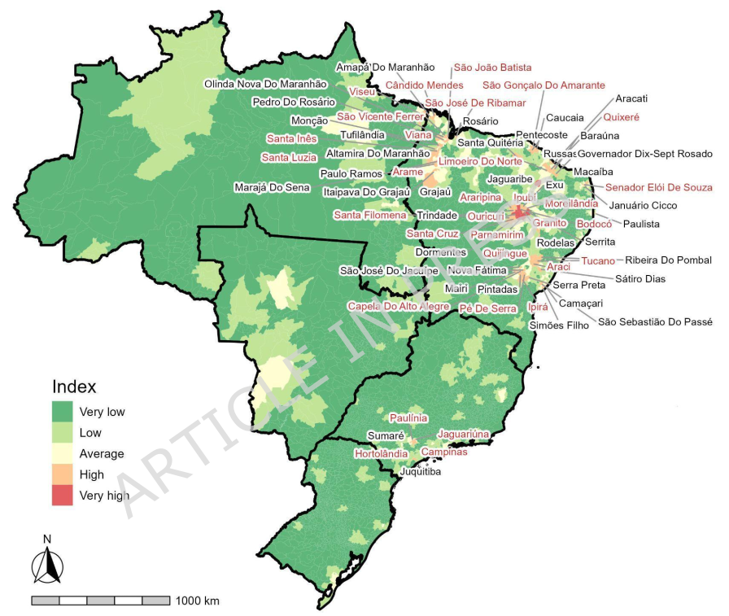

<div class="mt-4 d-flex flex-row flex-wrap gap-1 justify-content-left justify-content-sm-start" role="group" aria-label="Links">
  <a href="https://doi.org/10.1038/s41598-026-60843-w" class="btn btn-custom text-capitalize" target="_blank"><i class="ai ai-doi me-1"></i>DOI</a>
  <a href="/publications/2026-furlan-etal.pdf" class="btn btn-custom text-capitalize" target="_blank"><i class="bi bi-file-earmark-pdf me-1"></i>PDF</a>
</div>

<style>
  .btn-custom {
    background-color: white;
    border: 1px solid #1c6cbe; /* Borda azul */
    color: #1c6cbe; /* Texto azul */
    transition: background-color 0.3s, color 0.3s;
  }
  .btn-custom:hover {
    background-color: #1c6cbe; /* Cor de fundo azul ao passar o mouse */
    color: white; /* Texto branco */
  }
</style>

<br> 



## Resumo

Agricultural expansion and urbanization create fragmented landscapes that alter resources for wildlife. These changes influence populations of key pathogen reservoirs, affecting zoonotic disease risk. In the Neotropics, common vampire bats (*Desmodus rotundus*) often benefit from fragmented areas where cattle pastures replace their native habitat with cattle acting as a food source and contributing to their population growth and geographic expansion. Because *D. rotundus* is a key reservoir of the rabies virus, understanding its distribution is essential for anticipating and mitigating rabies risk. We analyzed priority areas for rabies prevention across Brazil’s 5,570 municipalities using vulnerability, exposure, and hazard indicators, including *D. rotundus* potential distribution, human rabies cases, rabies in dogs and cats, and environmental and socioeconomic descriptors available from the Brazilian government and open datasets. Using spatial prioritization methods, we ranked municipalities to identify priority areas for prevention and control. From 2001 to 2024, an average of six human rabies cases occurred annually in 1.45% of municipalities (N = 81). For cats and dogs (N = 240), cases occurred in 122(2.19%) of municipalities, not overlapping with human cases. Priority areas included the municipalities of Ouricuri (Pernambuco), Viseu (Pará), and several cities in Maranhão, including those where no cases were reported. These findings can support targeted One Health interventions by identifying municipalities with elevated structural and historical susceptibility to rabies risk, supporting 2030 rabies-elimination goals.

## Citação

```
@article{furlan_etal_2026,
    author = {Maria Eduarda Furlan, David T. S. Hayman, Masako Wada, Milton Cezar Ribeiro, Renata L. Muylaert, Maurício Humberto Vancine},
    title = "{Optimizing human rabies prevention in Brazil through spatial prioritization and a One Health approach}",
    journal = {Scientific Reports},
  	volume = {},
    number = {},
    pages = {},
    year = {2026},
    month = {},
   	issn = {},
    doi = {10.1038/s41598-026-60843-w},
    url = {https://doi.org/10.1038/s41598-026-60843-w}
}
```
