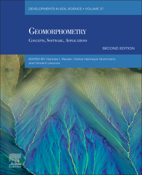

<div class="mt-4 d-flex flex-row flex-wrap gap-1 justify-content-left justify-content-sm-start" role="group" aria-label="Links">
  <a href="https://shop.elsevier.com/books/geomorphometry/reuter/978-0-443-33376-7" class="btn btn-custom text-capitalize" target="_blank"><i class="fas fa-link me-1"></i>link</a>
  <a href="https://www.amazon.com.br/Geomorphometry-Concepts-Software-Applications-Developments-ebook/dp/B0DND41HJ2" class="btn btn-custom text-capitalize" target="_blank"><i class="fab fa-amazon me-1"></i>Amazon</a>
</div>

<style>
  .btn-custom {
    background-color: white;
    border: 1px solid #1c6cbe; /* Borda azul */
    color: #1c6cbe; /* Texto azul */
    transition: background-color 0.3s, color 0.3s;
  }
  .btn-custom:hover {
    background-color: #1c6cbe; /* Cor de fundo azul ao passar o mouse */
    color: white; /* Texto branco */
  }
</style>

<br> 



## Resumo

Geology, topography, and geomorphology play a crucial role in shaping the Earth’s ecological patterns and processes at multiple spatial scales (Anderson and Ferree, 2010). Among other elements, they influence soil characteristics and properties, water availability, climatic conditions, and energy fluxes (e.g., solar radiation, wind exposure, and water regimes), which, in turn, shape habitats and affect biodiversity. Quantifying terrain characteristics and describing the geomorphology of an area help ecologists link these characteristics and features to species’ habitat requirements and distribution patterns. When such relationships are established, they can be used to model different ecological variables (e.g., species distribution, diversity, habitat suitability) in space and time, for example to predict a species’distribution in unsampled areas or to predict its future hypothesized distribution based on different climate-change scenarios. In addition, the topography can be modified by plants and animals; for example, vegetation influences slope stability, and many animals alter the micro-landscape by burrowing or digging.

The interest in ecological mapping has existed for centuries. Most early ecological maps focused on vegetation mapping using coarse thematic resolutions—classes such as forests, pastures, and crops—and as supplementary information for topographic, military, or settlement maps (Jelaska, 2009). By the 20th century, various hierarchical systems for vegetation classification had been developed, offering standardized methods for producing ecological maps (see Jelaska, 2009). After the Second World War, this type of mapping gained even more traction, boosted by developments in aerial photography. Since then, new means for Earth observation (i.e., satellite remote sensing, uncrewed aerial vehicles) and accurate positioning, and developments in Geographic Information Systems (GIS) have facilitated the integration of other aspects of the natural environment—beyond vegetation and including terrain, soil, and climate—into ecological maps. This results in more holistic representations useful for natural resources management, environmental impact assessments, and as a spatial decision-support tool in conservation, for example. In general, contemporary ecological mapping focuses on the structure, function, and spatial arrangement of living and nonliving elements that form ecosystems.

By deriving variables such as slope, aspect, curvature, and a topographic wetness index from digital elevation models (DEMs), geomorphometry enables ecologists to model environmental gradients and spatial heterogeneity critical for species distributions, habitat delineation, and ecological processes. For example, terrain-derived indices were used to map habitat suitability for ground-nesting birds (e.g., Korne et al., 2020) or to delineate microrefugia under climate-change scenarios (Hoffrén and García, 2023). This chapter provides an overview of general mapping approaches used in ecology that can integrate geomorphometric elements. Two broad types of approaches are presented: ecological classifications and distribution models. Then, case studies for each approach, based on the common dataset for this book (see Chapter 1), are presented.

## Citação 

```
@incollection{lecours_ecological_2026,
	title = {Ecological applications of geomorphometry},
	volume = {37},
	copyright = {https://www.elsevier.com/tdm/userlicense/1.0/},
	isbn = {978-0-443-33376-7},
	url = {https://linkinghub.elsevier.com/retrieve/pii/B9780443333767000379},
	doi = {10.1016/B978-0-44-333376-7.00037-9},
	language = {en},
	urldate = {2026-09-07},
	booktitle = {Geomorphometry: {Concepts}, {Software}, {Applications}},
	publisher = {Elsevier},
	author = {Lecours, Vincent and LeClerc, Emma and Moudrý, Vítězslav and Vancine, Maurício Humberto},
	year = {2026},
	pages = {711--731},
}
```
