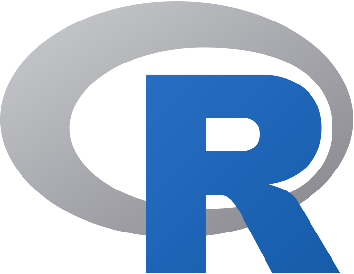

<div class="mt-4 d-flex flex-row flex-wrap gap-1 justify-content-left justify-content-sm-start" role="group" aria-label="Links">
  <a href="https://doi.org/" class="btn btn-custom text-capitalize" target="_blank"><i class="ai ai-doi me-1"></i>DOI</a>
  <a href="/publications/2026b-vancine-etal.pdf" class="btn btn-custom text-capitalize" target="_blank"><i class="bi bi-file-earmark-pdf me-1"></i>PDF</a>
  <a href="/publications/2026b-vancine-etal_sm.pdf" class="btn btn-custom text-capitalize" target="_blank"><i class="bi bi-file-earmark-pdf me-1"></i>Metadados</a>
  <a href="/publications/2026b-vancine-etal_pt.pdf" class="btn btn-custom text-capitalize" target="_blank"><i class="bi bi-file-earmark-pdf me-1"></i>PDF - Português</a>
</div>

<style>
  .btn-custom {
    background-color: white;
    border: 1px solid #1c6cbe; /* Borda azul */
    color: #1c6cbe; /* Texto azul */
    transition: background-color 0.3s, color 0.3s;
  }
  .btn-custom:hover {
    background-color: #1c6cbe; /* Cor de fundo azul ao passar o mouse */
    color: white; /* Texto branco */
  }
</style>

<br> 



## Resumo

The R programming language, esteemed for its statistical prowess, data management, data visualization, and machine learning capabilities, has become a cornerstone of data science applied to Ecology. Its open-source nature and broad array of analytical tools have garnered a user base, mainly among ecologists. Nevertheless, instructing R to biology and ecology students presents some key challenges. Here, we delve into the nuances of teaching R in graduate and undergraduate ecology courses, focusing on data wrangling, data visualization, and statistics. We provide insights from educators at various career stages, with a strong focus on the Brazilian context. No single way of teaching R fits all situations; however, some general guidelines can be provided and followed. Before starting this educational journey, the foundations must be addressed, including infrastructure, hardware, and software. Once these prerequisites are secured, students confront the intricacies of R’s programming landscape. Abstract concepts, coding idiosyncrasies, package compatibility, and the interplay between code and data need to be mastered. The narrative progresses to the challenge of interpreting R’s outputs and integrating them seamlessly into statistical and ecological analyses. Additionally, we consider the impact of structural challenges and global pressures on R education, such as the COVID-19 pandemic and the evolving influence of artificial intelligence tools. In conclusion, exploring R within ecology envisions a future where professionals possess the analytical skills to unlock innovative solutions and applications. As this educational journey concludes, we present our perspective on the future of R teaching and how it can help develop our science.

A linguagem de programação R, estimada por sua habilidade estatística, gerenciamento de dados, visualização de dados e capacidades de aprendizado de máquina, tornou-se uma pedra angular da ciência de dados aplicada à Ecologia. Sua natureza de código aberto e ampla gama de ferramentas analíticas conquistaram uma base de usuários, principalmente entre os ecólogos. No entanto, instruir R para estudantes de biologia e ecologia apresenta alguns desafios-chave. Aqui, mergulhamos nas nuances de ensinar R em cursos de graduação e pós-graduação em ecologia, focando na manipulação de dados, visualização de dados e estatísticas. Fornecemos percepções de educadores em várias fases da carreira, com forte foco no contexto brasileiro. Não existe uma única maneira de ensinar R que se adapte a todas as situações; no entanto, algumas diretrizes gerais podem ser fornecidas e seguidas. Antes de iniciar essa jornada educacional, é necessário abordar os fundamentos, incluindo infraestrutura, hardware e software. Uma vez garantidos esses pré-requisitos, os estudantes enfrentam as complexidades do ambiente de programação do R. Conceitos abstratos, idiossincrasias de codificação, compatibilidade de pacotes e a interação entre código e dados precisam ser dominados. A narrativa progride para o desafio de interpretar os resultados do R e integrá-los perfeitamente em análises estatísticas e ecológicas. Além disso, consideramos o impacto dos desafios estruturais e as pressões globais na educação em R, como a pandemia de COVID-19 e envolvendo a influência das ferramentas de inteligência artificial. Em conclusão, explorar o R na ecologia vislumbra um futuro em que os profissionais possuem as habilidades analíticas para desbloquear soluções e aplicações inovadoras. À medida que essa jornada educacional termina, apresentamos nossa perspectiva sobre o futuro do ensino de R e como ele pode ajudar a desenvolver nossa ciência.

## Citação

```
@article{vancine_etal_2026b,
    author = {Maurício Humberto Vancine, Pavel Dodonov, Bruno Vilela, Luisa Diele-Viegas, Victor Casagrande Souza, Felipe Alvarez Silva Nunes, Ana Julia Oliveira Silva, Beatriz Milz, Cristina A. Kita, Marco A. R. Mello, Renata L. Muylaert},
    title = "{The challenges and nuances of teaching the R programming language to ecologists}",
    journal = {Oecologia Australis},
    year = {2026},
    month = {01},
    issn = {2177-6199},
    doi = {},
    url = {},
    eprint = {},
}
```
